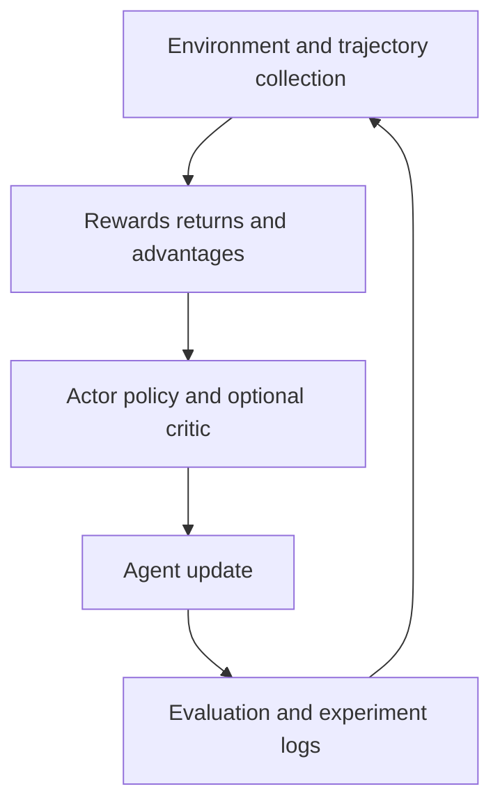

CS285 Deep Reinforcement Learning
This repository records my independent study of UC Berkeley's CS285. I use the lectures and programming assignments as hands-on practice alongside my deep learning studies, connecting neural-network implementation with sequential decision-making and experimental evaluation.
Current status (September 2026): HW2 completed; lectures studied through Variational Inference. The repository is actively updated as I refine code, add notes, and continue the course.
Progress and scope
Area	Current status
CS285 lectures	Studied through Variational Inference
HW2	Completed
PPO, GRPO, RLHF	Studied; code implementations are documented separately as they are published
Repository	Ongoing updates to code, explanations, and experiments

Code framework
The project follows the reinforcement learning training loop below. This is a conceptual map of the code, not a claim that every component has a finished, independent implementation in the repository.

Component	Responsibility
Environment interaction	Collect observations, actions, rewards, termination flags, and trajectories.
Return and advantage computation	Convert collected rewards into training targets; use baselines or advantage estimates where applicable.
Actor and critic	Represent the policy and, when used, estimate state values for the baseline.
Agent update	Compute the learning objective and apply optimizer updates.
Training orchestration	Run collection, updates, evaluation, and checkpoint selection in a repeatable sequence.
Experiment records	Keep configurations, seeds, learning curves, and notes together so results can be inspected.

HW2 implementation focus: policy gradients, returns versus reward-to-go, baselines, and the actor-critic update pipeline. Later algorithms will be identified as implementations only after their code and results are available.
Notes
I am adding handwritten notes alongside the code. The first few pages of the handwritten notes are blank; please keep scrolling to reach the actual course material.
笔记说明：手写笔记前几页留空，请耐心往下翻，正式课程内容在后面。
The notes file will be linked here after it is added to the repository. Lecture progress and assignment completion are tracked separately: studying a topic does not imply that its code is already implemented or tested here.
Repository updates
This is an evolving learning repository. I will document the exact file layout and runnable commands as the public code is organized. Where course starter code is used, I will preserve its notices and identify my own additions.
